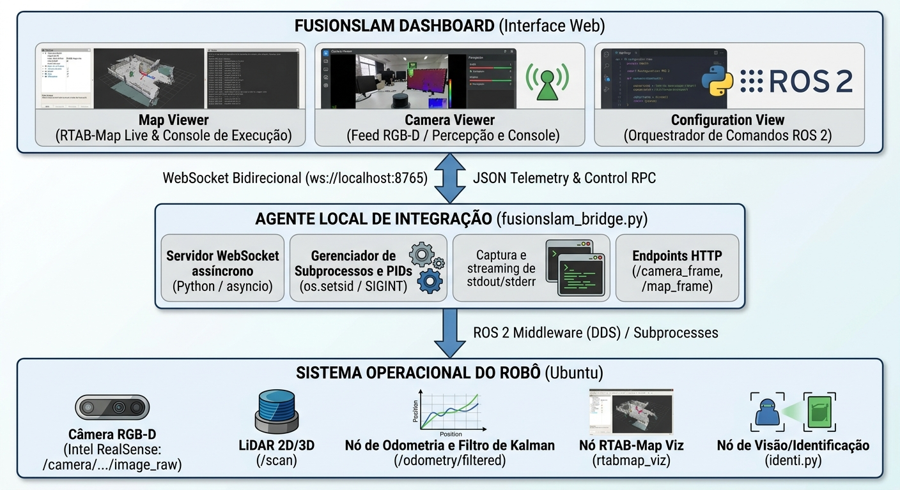
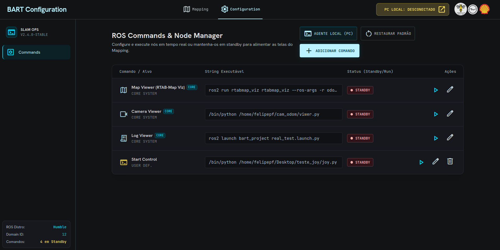
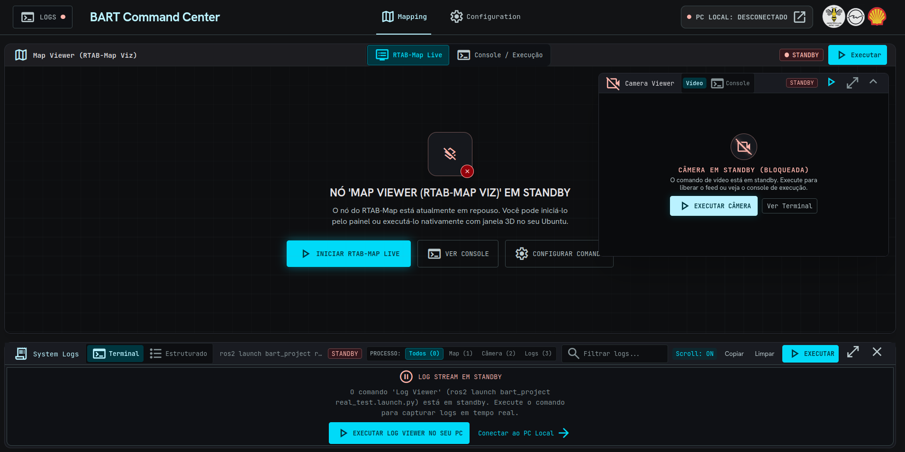

# 🚀 BART Command Center


> 🌐 **Selecione o idioma / Choose your language**

<details>
<summary><b>🇧🇷 Português (Brasil)</b></summary>

<br>

## ⚠️ AVISO — REPOSITÓRIO VITRINE ⚠️

Este repositório é uma **vitrine pública** do projeto **BART Command Center**.

O **código-fonte completo é mantido em um repositório privado**, pois contém informações sensíveis que não devem ser compartilhadas publicamente.

Aqui você encontrará:

- ✅ Descrição do projeto e funcionalidades
- ✅ Demonstrações (vídeos, imagens e GIFs)
- ✅ Arquitetura e tecnologias utilizadas
- ✅ Formas de contato para mais informações

📧 **Para acesso ao código, colaborações ou dúvidas:** entre em contato pelo e-mail informado na seção [Contato](#-autor--contato).

---

## 📑 Sumário

- [📖 Visão Geral](#-visão-geral)
  - [🎯 Objetivo](#-objetivo)
- [🏗️ Arquitetura do Sistema](#️-arquitetura-do-sistema)
  - [🔄 Fluxo de Comunicação](#-fluxo-de-comunicação)
- [🧩 Principais Módulos Funcionais](#-principais-módulos-funcionais)
  - [3.1. 🎛️ Orquestrador de Processos e Comandos — Configuration View](#31-️-orquestrador-de-processos-e-comandos--configuration-view)
  - [3.2. 🗺️ Visualizador Operacional — Map Viewer](#32-️-visualizador-operacional--map-viewer)
  - [3.3. 🛑 Segurança Operacional — E-STOP](#33-️-segurança-operacional--e-stop)
- [🎥 Demonstração](#-demonstração)
- [✅ Benefícios](#-benefícios)
- [👥 Autor / Contato](#-autor--contato)

---

## 📖 Visão Geral

O **BART Command Center** é uma plataforma integrada de **Estação de Controle Terrestre (GCS / HMI)** projetada para **monitoramento e orquestração de códigos em tempo real** para o robô BART (Basic Autonomous Rover for Testing) equipado com o ecossistema **ROS 2 (Humble Hawksbill)** e o algoritmo de mapeamento e localização visual/LiDAR **RTAB-Map** (*Real-Time Appearance-Based Mapping*).

### 🎯 Objetivo

Operadores de robótica em campo frequentemente precisam lidar com a **dispersão operacional** causada por múltiplos terminais, janelas de `rviz2`, visualizadores de câmera, monitores de execução de códigos e consoles de log espalhados pela tela.

O **BART Command Center** elimina essa fragmentação ao unificar, em um **painel único e coeso**:

| Recurso Unificado | Descrição |
|---|---|
| 🔧 Ciclo de vida dos nós ROS 2 | Cadastro, execução e encerramento de processos |
| 🗺️ Visualizador 3D do RTAB-Map | Inspeção do mapa e fluxos de odometria em tempo real |
| 📷 Streaming de visão computacional | Feed RGB-D |
| 🛑 Parada de Emergência (E-STOP) | Interrupção segura e imediata de todos os processos |

---

## 🏗️ Arquitetura do Sistema

O sistema opera em uma **arquitetura de duas camadas** com comunicação **bidirecional em tempo real** via WebSocket:



### 🔄 Fluxo de Comunicação

1. **Frontend (React)** ↔ **Agente Local (Python)** via **WebSocket** (`ws://localhost:8765`)
2. **Agente Local** ↔ **Sistema do Robô** via **subprocessos ROS 2** e **middleware DDS**
3. **Streaming de frames** (câmera e mapa) servidos via **endpoints HTTP** dedicados

---

## 🧩 Principais Módulos Funcionais

### 3.1. 🎛️ Orquestrador de Processos e Comandos — *Configuration View*



Gerencia o ciclo de vida completo dos nós ROS 2 diretamente pela interface web.

- **Gerenciamento de Ciclo de Vida:** cadastro, salvamento, parametrização e despacho de comandos de terminal diretamente para o SO hospedeiro.
- **Isolamento de Processos:** cada nó recebe um **PID único** e é executado em uma **sessão dedicada** (`os.setsid`), garantindo que o comando e todos os seus subprocessos ROS 2 sejam encerrados corretamente via:
  - `SIGINT` → encerramento gracioso (equivalente a `Ctrl+C`)
  - `SIGTERM` / `SIGKILL` → encerramento forçado quando necessário
- **Presets Integrados:** configurações prontas para os comandos críticos do pipeline (ex.: `rtabmap_viz` com remapeamento de tópicos e `identi.py`).

### 3.2. 🗺️ Visualizador Operacional — *Map Viewer*



Integração nativa com o nó oficial `rtabmap_viz` no ROS 2, com **sincronização temporal aproximada** (`approx_sync:=true`) entre os seguintes tópicos:

| Tópico | Descrição |
|---|---|
| `/odometry/filtered` | Odometria Filtrada (EKF) |
| `/camera/camera/color/image_raw` | Imagem colorida RGB |
| `/camera/camera/aligned_depth_to_color/image_raw` | Profundidade alinhada |
| `/scan` | Laser Scan do LiDAR |
| `/camera/camera/color/camera_info` | Parâmetros intrínsecos da câmera |

**Abas disponíveis:**

- **RTAB-Map Live:** exibe o frame da visualização do mapeamento transmitido pelo agente de streaming local.
- **Camera Viewer:** recepção de quadros processados do nó de visão computacional (detecção de objetos/classes ou feed direto da RealSense).
- **Console / Execução:** monitor de terminal em tempo real com `stdout`/`stderr`, uptime, taxa de atualização calculada e mensagens de sincronização.

### 3.3. 🛑 Segurança Operacional — *E-STOP*

O botão de **Parada de Emergência** envia um **broadcast prioritário** via WebSocket para o agente local, que emite **`SIGINT`/`SIGTERM` instantâneo** em **todos os processos ativos registrados**, garantindo a interrupção segura dos atuadores e das rotinas de navegação.

---

## 🎥 Demonstração


---

## ✅ Benefícios

- ❌ **Sem múltiplos terminais SSH** ou telas divididas em campo
- ✅ **Operação centralizada** em um único painel
- ✅ **Rastreabilidade completa** dos processos de navegação e mapeamento
- ✅ **Encerramento seguro** de processos com isolamento de sessão
- ✅ **E-STOP confiável** com broadcast prioritário

---

## 👥 Autor / Contato / Licença

* **Autor:** Felipe Pereira Furlaneto
* **Contato:** [ffurlaneto@usp.br](mailto:ffurlaneto@usp.br)
* **Laboratório:** Aerotech
* **Instituição:** Escola de Engenharia de São Carlos - Universidade de São Paulo (EESC-USP)
* **LinkedIn:** [felipepereira56](https://www.linkedin.com/in/felipepereira56/)


> 📧 **Este projeto possui código-fonte privado.** Para solicitar acesso, propor colaborações ou tirar dúvidas técnicas, entre em contato pelos canais acima.

O código e as especificações deste repositório estão licenciados sob a Licença Apache 2.0. Sinta-se livre para utilizar e distribuir, desde que sejam mantidos os devidos créditos e referências ao autor original, à instituição e ao Laboratório.

```text
Copyright 2026 Felipe Pereira Furlaneto (EESC-USP) - Aerotech

Licensed under the Apache License, Version 2.0 (the "License");
you may not use this file except in compliance with the License.
You may obtain a copy of the License at

    http://www.apache.org/licenses/LICENSE-2.0

Unless required by applicable law or agreed to in writing, software
distributed under the License is distributed on an "AS IS" BASIS,
WITHOUT WARRANTIES OR CONDITIONS OF ANY KIND, either express or implied.
See the License for the specific language governing permissions and
limitations under the License.
```

</details>

<details>
<summary><b>🇺🇸 English</b></summary>

<br>

## ⚠️ NOTICE — SHOWCASE REPOSITORY ⚠️

This repository is a **public showcase** of the **BART Command Center** project.

The **full source code is kept in a private repository**, as it contains sensitive information that should not be shared publicly.

Here you will find:

- ✅ Project description and features
- ✅ Demonstrations (videos, images, and GIFs)
- ✅ Architecture and technologies used
- ✅ Contact information for further inquiries

📧 **For source code access, collaborations, or questions:** please reach out via the email listed in the [Contact](#-author--contact) section.

---

## 📑 Table of Contents

- [📖 Overview](#-overview)
  - [🎯 Objective](#-objective)
- [🏗️ System Architecture](#️-system-architecture)
  - [🔄 Communication Flow](#-communication-flow)
- [🧩 Main Functional Modules](#-main-functional-modules)
  - [3.1. 🎛️ Process & Command Orchestrator — Configuration View](#31-️-process--command-orchestrator--configuration-view)
  - [3.2. 🗺️ Operational Viewer — Map Viewer](#32-️-operational-viewer--map-viewer)
  - [3.3. 🛑 Operational Safety — E-STOP](#33-️-operational-safety--e-stop)
- [🎥 Demo](#-demo)
- [✅ Benefits](#-benefits)
- [👥 Author / Contact](#-author--contact)

---

## 📖 Overview

The **BART Command Center** is an integrated **Ground Control Station (GCS / HMI)** platform designed for **real-time monitoring and orchestration of code execution** for the BART robot (Basic Autonomous Rover for Testing), equipped with the **ROS 2 (Humble Hawksbill)** ecosystem and the visual/LiDAR mapping and localization algorithm **RTAB-Map** (*Real-Time Appearance-Based Mapping*).

### 🎯 Objective

Field robotics operators often face **operational fragmentation** caused by multiple terminals, `rviz2` windows, camera viewers, code execution monitors, and log consoles scattered across the screen.

The **BART Command Center** eliminates this fragmentation by unifying everything into a **single cohesive panel**:

| Unified Resource | Description |
|---|---|
| 🔧 ROS 2 node lifecycle | Registration, execution, and termination of processes |
| 🗺️ RTAB-Map 3D Viewer | Map inspection and odometry streams in real time |
| 📷 Computer vision streaming | RGB-D feed |
| 🛑 Emergency Stop (E-STOP) | Safe and immediate interruption of all processes |

---

## 🏗️ System Architecture

The system operates on a **two-layer architecture** with **bidirectional real-time communication** via WebSocket:


### 🔄 Communication Flow

1. **Frontend (React)** ↔ **Local Agent (Python)** via **WebSocket** (`ws://localhost:8765`)
2. **Local Agent** ↔ **Robot System** via **ROS 2 subprocesses** and **DDS middleware**
3. **Frame streaming** (camera and map) served via dedicated **HTTP endpoints**

---

## 🧩 Main Functional Modules

### 3.1. 🎛️ Process & Command Orchestrator — *Configuration View*


Manages the complete lifecycle of ROS 2 nodes directly through the web interface.

- **Lifecycle Management:** registration, saving, parameterization, and dispatch of terminal commands directly to the host OS.
- **Process Isolation:** each node receives a **unique PID** and runs in a **dedicated session** (`os.setsid`), ensuring the command and all its ROS 2 subprocesses are properly terminated via:
  - `SIGINT` → graceful shutdown (equivalent to `Ctrl+C`)
  - `SIGTERM` / `SIGKILL` → forced shutdown when necessary
- **Built-in Presets:** ready-made configurations for critical pipeline commands (e.g., `rtabmap_viz` with topic remapping and `identi.py`).

### 3.2. 🗺️ Operational Viewer — *Map Viewer*


Native integration with the official `rtabmap_viz` node in ROS 2, with **approximate time synchronization** (`approx_sync:=true`) between the following topics:

| Topic | Description |
|---|---|
| `/odometry/filtered` | Filtered Odometry (EKF) |
| `/camera/camera/color/image_raw` | RGB color image |
| `/camera/camera/aligned_depth_to_color/image_raw` | Aligned depth |
| `/scan` | LiDAR Laser Scan |
| `/camera/camera/color/camera_info` | Camera intrinsic parameters |

**Available tabs:**

- **RTAB-Map Live:** displays the mapping visualization frame streamed by the local streaming agent.
- **Camera Viewer:** receives processed frames from the computer vision node (object/class detection or direct RealSense feed).
- **Console / Execution:** real-time terminal monitor with `stdout`/`stderr`, uptime, calculated refresh rate, and synchronization messages.

### 3.3. 🛑 Operational Safety — *E-STOP*

The **Emergency Stop** button sends a **priority broadcast** via WebSocket to the local agent, which issues **instantaneous `SIGINT`/`SIGTERM`** to **all registered active processes**, ensuring safe interruption of actuators and navigation routines.

---

## 🎥 Demo


---

## ✅ Benefits

- ❌ **No more multiple SSH terminals** or split screens in the field
- ✅ **Centralized operation** in a single panel
- ✅ **Full traceability** of navigation and mapping processes
- ✅ **Safe process termination** with session isolation
- ✅ **Reliable E-STOP** with priority broadcast

---

## 👥 Author / Contact / License

* **Author:** Felipe Pereira Furlaneto
* **Contact:** [ffurlaneto@usp.br](mailto:ffurlaneto@usp.br)
* **Laboratory:** Aerotech
* **Institution:** São Carlos School of Engineering - University of São Paulo (EESC-USP)
* **LinkedIn:** [felipepereira56](https://www.linkedin.com/in/felipepereira56/)

> 📧 **This project has a private source code.** To request access, propose collaborations, or ask technical questions, get in touch through the channels above.

The code and specifications in this repository are licensed under the Apache License 2.0. Feel free to use and distribute, provided proper credit and references to the original author, institution, and Laboratory are maintained.

```text
Copyright 2026 Felipe Pereira Furlaneto (EESC-USP) - Aerotech

Licensed under the Apache License, Version 2.0 (the "License");
you may not use this file except in compliance with the License.
You may obtain a copy of the License at

    http://www.apache.org/licenses/LICENSE-2.0

Unless required by applicable law or agreed to in writing, software
distributed under the License is distributed on an "AS IS" BASIS,
WITHOUT WARRANTIES OR CONDITIONS OF ANY KIND, either express or implied.
See the License for the specific language governing permissions and
limitations under the License.
```

</details>
